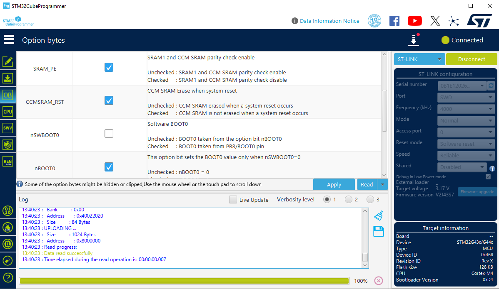

# Ability Hand CAN Interface Firmware

## Introduction

This is the firmware for an Ability Hand to CAN interface board which allows CAN-FD communication to the Ability Hand. This board allows for high throughput communication to the Ability Hand by locally managing the creation of Ability Hand extended communication mode data frames, as well as the ability to directly manipulate large UART transmit and recieve buffers over CAN. 

The CAN interface uses [DARTT](https://github.com/Ocanath/dartt-protocol), an open source C library and communication protocol which allows for block memory access to predefined memory in embedded systems. All settings, including control structures for Ability Hand API frame creation, non-volatile settings for the interface controller device, firmware version hash, and direct access to UART buffers can be accessed over DARTT.

The UART interface is designed for the [Ability Hand Extended Mode API Interface](https://github.com/psyonicinc/ability-hand-api/blob/master/Documentation/ABILITY-HAND-ICD.pdf), which is a custom frame format for efficient control and feedback of a PSYONIC Ability Hand.

## Compilation

To build this firmware, install STM32CubeIDE 1.14.0 or greater and import the project into your workspace. 

### Pre-Build Version Scripting

This codebase relies on pre-build scripting for firmware version tracking on-device. The proper build configuration must be selected in order to access this feature. The file 'verision.h' is generated from this script. 

1. **WINDOWS:** Select the 'Debug' or 'Release' build configurations.

1. **LINUX:** Select the 'ReleaseLinux' or 'DebugLinux' build configurations.

### Option Bits and Flashing

The device can be re-flashed with an ST-Link V2 (or similar) SWD programmer via. STM32CubeIde. If a V1-R1 PCB or prototype PCB is used, it is necessary to disable the nSWBOOT0 option bit from its default setting. This is a flash setting, so it is only necessary to do this one time. It is not modified by subsequent device flashing.

The simplest method to change this option bit is using the STM32CubeProgrammer software. Connect to the device over SWD and press 'Connect', then navigate to the option bytes (OB) tab, User Configuration, and un-check nSWBOOT0.

 

## Hand Configuration

 All UART data relies on byte stuffing for frame synchronization - the Ability Hand must be configured for this mode for communication to function properly. To properly enable the Ability Hand communication, you must send the following commands over BLE using Settings->Troubleshoot->Developer Mode:

 ```
 Wo
 We16
 We46
 We47
 ```

 This configures the hand for UART mode with byte-stuffing enabled. The Ability Hand checks for the frame delimiter character `~` at both the **start** and **end** of each frame. The escape and frame characters used match those in PPP/HDLC byte stuffing/frame synchronization - for more information see the [byte stuffing library submodule](./external/byte-stuffing) in this repository.